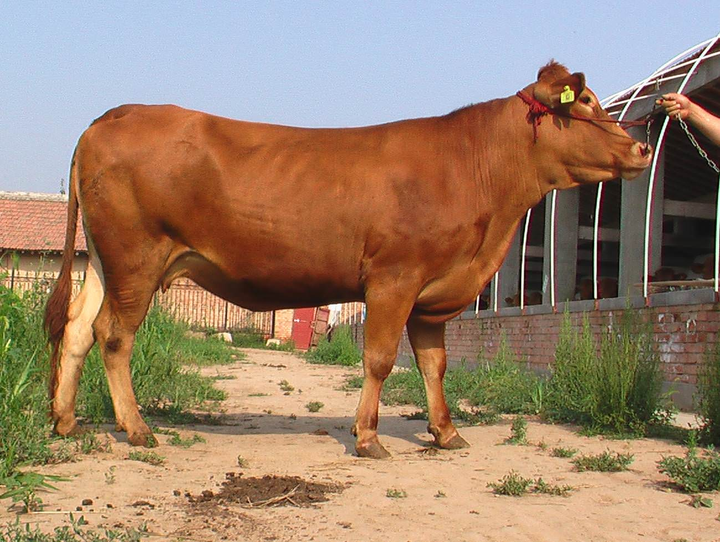
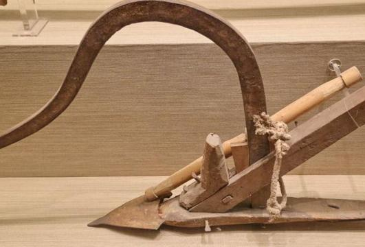
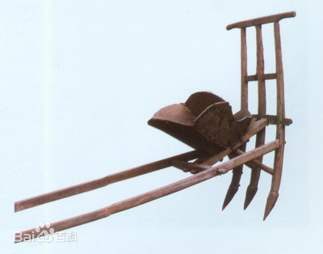
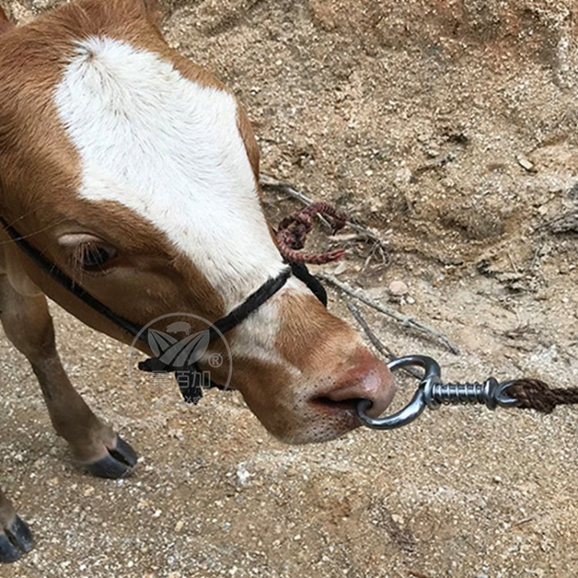

](//www.zhihu.com)

  * [首页](//www.zhihu.com/)
  * [知学堂](//www.zhihu.com/education/learning)
  * [会员](//www.zhihu.com/xen/vip-web)
  * [发现](//www.zhihu.com/explore)
  * [等你来答](//www.zhihu.com/question/waiting)

​

切换模式

登录/注册技术](//www.zhihu.com/topic/19550912)[制造业](//www.zhihu.com/topic/19551606)[动物保护](//www.zhihu.com/topic/19553074)[宠物训练](//www.zhihu.com/topic/19682485)[脑洞类问题](//www.zhihu.com/topic/19955433)

# 人类为何不大规模训练猴子做「流水线工人」?

看到一篇报道:泰国的一种猴子，每天可以帮助人类爬上椰子树，每天摘1600个椰子，效率是人类的16倍!显示全部 ​

关注者

**2,075**

被浏览

**3,160,393**

关注问题​写回答

​邀请回答

​好问题 17

​58 条评论

​分享

​

登录后你可以

不限量看优质回答私信答主深度交流精彩内容一键收藏

登录

[查看全部 955 个回答](/question/597376599)

](//www.zhihu.com/people/s.invalid)

[invalid s](//www.zhihu.com/people/s.invalid)​](https://www.zhihu.com/question/48509984)​

编程等 2 个话题下的优秀答主

​ 关注

10,162 人赞同了该回答

因为动物擅长偷奸使滑，绝不会像人类那样，为了一点工资自我奴役。

  

都不用猴子了；下面这种动物：

城市里听说过的不少，大多也看过图片——极少数消息灵通人士甚至看过视频！

但，你们没和它打过交道，绝不知道这家伙能有多奸猾。

  

我小时候家里养的一头牛，人家知道时间。

比如，一大早，甚至半夜起来，套牛，准备让它拉车、犁地了，这家伙就不乐意了：你牵着它往车辕里站，它很乖很听话；你往回走，打算把牛拉车的“套”给它套上：

它就后腿横跨两步，给你摆个45°夹角。

这就没法上套了。

于是，重新调整位置，站好，等套！

它一副很乖的样子，就等你往后走。一走，它又是后腿优雅的走上两步，重新摆个45°夹角。

  

这死牛，讨厌！

你翘个兰花指，推它屁股，想让它把这两步走回去？

哈哈，人家可听话的很——走了！

不过是四步。

左45°就成了右45°。

  

啊，这牛讨厌！揍它！

一揍就坏了，人家开始尥蹶子，发脾气，蹦蹦跳跳——拉车？别让我看见车！

于是见车就跳，根本牵不到车前！

  

怎么办呢？

搞点洋槐树叶之类牛喜欢的美食，给牛大娘吃点好吃的，顺顺毛，安抚安抚……

安抚高兴了，人家就继续站在车前，屁股扭来扭去给你摆45°角——你要眼疾手快，逮住它摆角度摆失误了、或者摆慢了的机会，把套挂身上了，它也就乖了。

每天，光给它上套，那是少则十几分钟、多则大半个小时……

  

到地里你以为就消停了？

犁地，我爸牵着，它乖；但犁地、种地都要有臂力，不然扶不动犁、摇不动耧（播种用的一种农具）：

犁出来的地就歪歪扭扭、种出来的庄稼瘌痢头一样，一块一块的。

  

只有男人才有足够的臂力干好这种活；所以牛得让我爷、我妈牵，我爸扶犁、摇耧……

得，牛不怕他们，耍猴时间又到了！

这家伙故意左走三步右走三步，拉的犁/耧扭来扭去——换我爸牵，马上走直线；但我爷种地不行，走不了几步就歪、或者摇耧摇太快。这样浪费种子不说；种太稠了，麦子豆子都会干长秧不结籽……

  

有一天，它这样闹太厉害了，把我爸惹恼了，啪一鞭子抽上去，老实了。

但牛是重要劳力，舍不得打啊。打坏了，这一年的地怎么种？

——我爸抽完就后悔了，吃饭时还在说：“眼看着（牛）身上就肿起了一道……”

  

就这样，打狠了，怕打坏它；打轻了，它就给你发牛脾气……

好在这牛还有一点好处，吃哄。你给它顺顺毛、喂点好吃的青草饲料，它高兴了，干活其实很利索。

农村人有句骂人话，影射有些人听不进好话、像个牲口一样。这句话是这样的：你真是牵着不走，打着倒退！

很形象，哈哈。

尤其牵过牛的都知道，你嫌它慢，想让它走快点，用力拉它缰绳——人家马上就站住，今天还不走了！拉出血也不走！有本事你把我鼻孔拉豁！

你一看，惹老牛生气了，赶紧认错，不硬拉了：一松手，人家走了。

当然，还是慢悠悠的。

  

总之，驱使牛啊马啊驴啊骡啊之类大牲口干活，你得顺着人家的脾气。硬来是绝对不行的。

  

更气人的是，这货知道什么时候该“下班”。

一看天光，时候快到了，该下班了，牛就开始频频回头看人，意思大概就是“都什么时候了？怎么还不让下班？！！”

你不搭理，人家就又要闹了。

  

好，下班。套车，回家！

你都不知道这种时候，这货能有多机灵——不用牵，自己就走车子旁边了；稍微一指挥就站对了位置，三两分钟就让你套好。

然后哞的一长声，回家喽！

一路小跑的拉着车就回家了。

* * *

小时候，村子里几乎家家养牛；每家的耕牛可以说各有各的个性。

  

有的认人，自家人驱使，可以；别人借去？想让牛大爷干活？做梦去吧！

有的，干活前憋着一泡屎，怎么都不肯拉出来；你给它套上、想让它干活，比如拉车、碾场，扑哧哧一大脸盆就怼出来了——尤其碾场，那是要往粮食里拉！

忙的主人赶紧拿大铁锹、木锨啥的接住——真接不住、漏进去了，就晒干了当商品粮卖给城里人吃（哈哈哈哈）。

  

牛都这么调皮，猫啊狗啊就更“坏”了。

  

比如当时俺家的保卫科长，那货有三大特色：

一、按时上下班。

晚上鸡回窝它上班，早上鸡叫它下班——上班期间，听见任何动静，哪怕树叶飘落，它都要汪汪的吼上好一会儿；但一到下班时间，邻居过来把门砸了，它当没听见。

看瓜也是。晚上跟着人到地里；早上鸡一叫扭头就走，喊都喊不住。

二、认识自家鸡。

嫌鸡在院子里淘气，喊狗去赶鸡，自家的鸡，狗跑过去转一圈就回来，有时候鸡都没动地方；别人家的鸡，狗扑过去叼住鸡尾巴，吓过一次这辈子不敢进我家院子。

三、认识亲戚。

这个“认识亲戚”甚至有点玄学色彩——邻居上门，不管多熟，它都要汪上一会儿表示自己尽职尽责了；你嫌吵？骂它？没用。不汪够不罢休。

但亲戚上门，哪怕第一次上门的亲戚，这货都只管跟在后面摇尾巴！

搞的一些亲戚都说你养这只狗没用，见生人不搭腔（吠叫），一个劲儿摇尾巴——等邻居来他就知道了，拼命叫。

就这么邪乎。

* * *

其实无论养狗牧羊、养猴子摘果子，说白了就是“动物天性”。

——狗就喜欢“围猎”玩，跟着主人出去撒欢、还有一大群“玩具”可以扑咬着玩，多好玩啊！

——猴子也喜欢在树上嬉闹、摘果子扔着玩……

这些，和猫爱抓耗子是一个道理。

  

人养它们，对人来说是工作，对它们来说是玩，这样它们才会积极配合。

但牛就不一样，拉犁拉车显然都不是玩——所以它就各种不配合。

而且，想让牛、马、驴、骡等牲口配合，一味凶它们是不行的——主人舍不得打，外人借走用可不爱惜它。但绝大多数的牛马还是只听主人话，外人越打它越反抗。

  

原因很简单，主人从小喂养它，脏了给它刷洗、顺毛，身上有蜱虫了主人帮它抓；吃的草料要提前储备好、细细切碎了；住的牛棚脏了给它清理、漏风漏雨都得赶紧帮它修补，万不能饿着、冻着它……

农民家庭，牛就是家里的一份子，比人的待遇不差。

这样养到大，人对牛有感情，牛对人也有感情。

调皮、奸猾，是有；但最后活还是会干……

  

借来的牛？

你得给人家吃顿好的，联络联络感情。不然……生牲口，搞不好伤人。

* * *

行了，就这种奸猾调皮的玩意儿，你指望它老老实实的、一天八小时坐在流水线前一丝不苟的给你干活？

想吧。

能让它们乖上半小时不捣蛋我都服你。

  

真以为都像人这种牲口……哦不，都像人这种动物一样，你给它俩钱，PUA几句，这牲口就能一天干十几个小时、把自己累到过劳死？

[编辑于 2023-05-01 21:31](//www.zhihu.com/question/597376599/answer/3005083915)・IP 属地广东

​赞同 1 万​​679 条评论

​分享

​收藏​喜欢收起​

[查看全部 955 个回答](/question/597376599)
