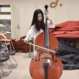

](//www.zhihu.com)

  * [首页](//www.zhihu.com/)
  * [知学堂](//www.zhihu.com/education/learning)
  * [会员](//www.zhihu.com/xen/vip-web)
  * [发现](//www.zhihu.com/explore)
  * [等你来答](//www.zhihu.com/question/waiting)

​

切换模式

登录/注册诗歌](//www.zhihu.com/topic/19564001)[现代诗](//www.zhihu.com/topic/19681298)

# 你听过最残忍的诗是什么？

关注者

**29,782**

被浏览

**22,639,809**

关注问题​写回答

​邀请回答

​好问题 2763

​50 条评论

​分享

​

登录后你可以

不限量看优质回答私信答主深度交流精彩内容一键收藏

登录

[查看全部 3,317 个回答](/question/339919577)

](//www.zhihu.com/people/Akikobaby)

[王介南](//www.zhihu.com/people/Akikobaby)​](https://www.zhihu.com/question/48509984)

艺术话题下的优秀答主

​ 关注

54,802 人赞同了该回答

许立志，男，1990年生，出生于广东揭阳。

2011年2月进入深圳富士康，成为流水线上的一名普通工人，与富士康签订了为期三年的劳动合同，却在之后坠楼身亡，警方疑为自杀。

  

——————————————————————

  

「**我就那样站着入睡**」 

眼前的纸张微微发黄 

我用钢笔在上面凿下深浅不一的黑

里面盛满打工的词汇 

车间，流水线，机台，上岗证，加班，薪水…… 

我被它们治得服服贴贴

我不会呐喊，不会反抗

不会控诉，不会埋怨 

只默默地承受着疲惫 驻足时光之初

我只盼望每月十号那张灰色的薪资单 

赐我以迟到的安慰

为此我必须磨去棱角，磨去语言 

拒绝旷工，拒绝病假，拒绝事假 

拒绝迟到，拒绝早退 

流水线旁我站立如铁，双手如飞 

多少白天，多少黑夜 

我就那样，站着入睡

————————————

  

「**被生活埋葬的心**」 

还要不要隐忍下去 眼皮早已沉重如山 

他的头试着在黑夜里抬起 沾满泪的星光就瓢泼而下

风一起，他单薄的身躯总要抖几抖 

少年时光在懊恼中离去 剩下一场雪，纷纷，纷纷

梦里，他品尝到的火苗都是冰冷的 

而磨损的皮肤像一床破绵絮 摊开在岁月的风里

固有的信念再找不到方向 

连同他那颗被生活埋葬的 比海洋更深的心

  

———————————— 

「**我咽下一枚铁做的月亮……**」 

我咽下一枚铁做的月亮 

他们把它叫做螺丝 

我咽下这工业的废水，失业的订单 

那些低于机台的青春早早夭亡 

我咽下奔波，咽下流离失所 

咽下人行天桥，咽下长满水锈的生活 

我再咽不下了 

所有我曾经咽下的现在都从喉咙汹涌而出 

在祖国的领土上铺成一首 耻辱的诗 

  

————————————

「**我一生中的路还远远没有走完**」 

这是谁都没有料到的

我一生中的路 还远远没有走完 就要倒在半路上了

类似的困境 以前也不是没有 只是都不像这次 来得这么突然 这么凶猛

一再地挣扎 竟全是徒劳

我比谁都渴望站起来 可是我的腿不答应 我的胃不答应 我全身的骨头都不答应

我只能这样平躺着

在黑暗里一次次地发出 无声的求救信号

再一次次地听到 绝望的回响

  

————————————

「**流水线上的雕塑**」

沿着流水线，笔直而下

我看到了自己的青春

汩汩流动，如血般地

主板，弹片，铁盒……一一晃过

手头的活没人会帮我干

幸亏所在的工站赐我以

双手如同机器

不知疲倦地，抢，抢，抢

直到手上盛开着繁华的

茧，渗血的伤

我都不曾发现

自己早站成了

一座古老的雕塑

————————————

  

「**冲突**」

他们都说

我是个话很少的孩子

对此我并不否认

实际上

我说与不说

都会跟这个社会

发生冲突

  

————————————

  

「**存在与价值**」

被吃掉

是肉存在的唯一价值

因此当我一片接一片地

吃掉自己身上的肉时

我实现了

自我存在的价值

  

————————————

  
「**搬运工**」

野花筑成的铁轨深藏疾病

他驮着生活的贫苦拉动叉车

剩下一个绝望的背影，佝偻的灵魂

在牛羊颤栗的城市长久地失眠

螺丝，加班，物料，病历，鲜血……

他看着车间上空飘来飘去的词汇

布满血丝的双眼像溃烂的伤口敞开着

去迎接打工生活里的风雪和盐水

那些与青春有关的梦想与产品一起打包

贩卖到大洋彼岸，等候下一个轮回

  

————————————

  

「**远航**」

我想在凌晨五点的流水线上睡去

我想合上双眼，不再担忧熬夜和加班

此行的终点是大海，我是一条船

[编辑于 2021-02-02 22:07](//www.zhihu.com/question/339919577/answer/1709056112)

​赞同 5.4 万​​1,844 条评论

​分享

​收藏​喜欢收起​

[查看全部 3,317 个回答](/question/339919577)
